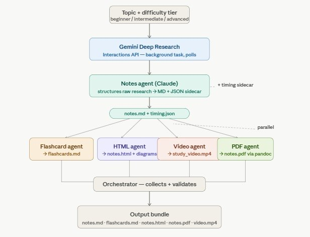

# parallel-ai-agents

A research codebase for parallelising LLM-driven content generation. The
pipeline takes a topic and difficulty tier as input and produces a bundle
of study artifacts — structured notes, flashcards, an HTML render, a PDF,
and a narrated video — by fanning a single research stage out to several
specialised agents that run concurrently.

The project is developed as part of an Undergraduate Research Opportunities
Programme (UROP) at the Singapore University of Technology and Design.

## Project scope

The repository hosts two complementary tracks:

1. **Benchmark track (Vertex AI / Gemini).** Standalone scripts that
   compare `asyncio`-based concurrency against `multiprocessing`-based
   parallelism for fan-out across three and six agents. Used to quantify
   true vs. concurrent execution and to inform the eventual Rust port.
2. **Pipeline track (Anthropic / Claude).** A working
   `Notes -> Flashcards -> Video` pipeline built on the Claude API with
   tool use. This is the basis for the broader study-content pipeline
   described under "Target architecture".

## Target architecture

```
Topic + difficulty tier (beginner / intermediate / advanced)
        |
        v
Gemini Deep Research        (Interactions API; background task with polling)
        |
        v
Notes agent (Claude)        (raw research -> notes.md + timing.json sidecar)
        |
        v
notes.md + timing.json
        |
   ----------------------------------------------------     parallel fan-out
   |                |                  |               |
   v                v                  v               v
Flashcard agent  HTML agent         Video agent     PDF agent
-> flashcards.md -> notes.html      -> study_       -> notes.pdf
                    + diagrams         video.mp4       (via pandoc)
   |                |                  |               |
   ----------------------------------------------------
                          |
                          v
              Orchestrator (collects + validates artifacts)
                          |
                          v
              Output bundle
              notes.md, flashcards.md, notes.html, notes.pdf, video.mp4
```

`orchestrator.py` implements this architecture today: Notes runs first,
Flashcards and Video fan out in parallel, then PDF export runs last. (The
HTML agent and the Gemini Deep Research front-end remain the active work.)



## Repository layout

```
.
├── parallel_agent.py        Three-agent Gemini fan-out (asyncio + multiprocessing)
├── parallel_agent_6.py      Six-agent Gemini fan-out
├── chat_session.py          Stateful vs. stateless Gemini chat reference
├── orchestrator.py          Claude-side pipeline driver (working entry point)
├── benchmark_test.py        Benchmark harness
├── requirements.txt
└── src/
    ├── main.py              Pipeline entry point (Claude track)
    └── agents/
        ├── base_agent.py            AbstractStudyAgent + tool definitions
        └── specialist_agent.py      NotesAgent, FlashcardAgent, VideoAgent, PDFAgent
```

## Prerequisites

- Python 3.11 or newer.
- `ffmpeg` available on `PATH` (required by `moviepy` for the video stage).
- `pandoc` plus a PDF engine (required by `PDFAgent`). The agent auto-detects
  whichever engine is installed — a LaTeX engine (`tectonic`, `xelatex`,
  `lualatex`, or `pdflatex`) or an HTML engine (`wkhtmltopdf`, `weasyprint`).
  `tectonic` is recommended on Windows: it is a single self-contained binary
  that fetches LaTeX packages on first use. `PDFAgent` resolves `pandoc` and
  the engine by absolute path, so they do **not** need to be on `PATH`.
- A Google Cloud project with the Vertex AI API enabled (benchmark track).
- API access to Anthropic Claude and OpenAI (pipeline track).

### Installing ffmpeg and pandoc

**macOS** (Homebrew):

```
brew install ffmpeg pandoc
brew install --cask basictex      # LaTeX engine for the PDF stage
```

**Windows** (winget):

```
winget install Gyan.FFmpeg
winget install JohnMacFarlane.Pandoc
winget install MiKTeX.MiKTeX       # LaTeX engine for the PDF stage
```

For the PDF engine, `tectonic` is a lighter alternative to a full LaTeX
distribution. If it is not in your `winget` source, download the official
Windows binary from
https://github.com/tectonic-typesetting/tectonic/releases and place
`tectonic.exe` in `%LOCALAPPDATA%\Tectonic` — `PDFAgent` searches that
directory automatically.

`ffmpeg` must be on `PATH` for the video stage. `pandoc` and the PDF engine
do **not** need to be on `PATH`: `PDFAgent` resolves them by absolute path,
searching `PATH` plus the standard install locations (so a stale `PATH`
after install no longer breaks PDF export). You can still verify them:

```
ffmpeg -version
pandoc --version
```

`ffmpeg` is required for the video stage — without it `VideoAgent` cannot
assemble `study_video.mp4`. `pandoc` (plus a PDF engine) is only needed
for the PDF stage; if either is absent the pipeline skips PDF export and
still produces the rest of the bundle.

## Setup

### 1. Install Python dependencies

```
pip install -r requirements.txt
playwright install
```

The `playwright install` step downloads the browser binaries used by the
HTML rendering helpers in `specialist_agent.py`. `duckduckgo_search` backs
the `web_search` / `image_search` tools the `NotesAgent` calls; without it
those tool calls return an install-hint string instead of real results.

### 2. Authenticate Google Cloud (benchmark track)

The Vertex AI SDK uses Application Default Credentials rather than a
static API key:

```
gcloud auth application-default login
```

### 3. Configure environment variables

Create a `.env` file at the repository root. All scripts call
`load_dotenv()` and resolve configuration from this file.

```
# Anthropic Claude (pipeline track)
CLAUDE_API_KEY=...

# OpenAI (text-to-speech in the video agent)
OPENAI_API_KEY=...

# Google / Gemini (benchmark track)
GOOGLE_API_KEY=...
GCP_PROJECT_ID=your-gcp-project-id
GCP_LOCATION=asia-southeast1
```

`.env` is git-ignored. Do not commit credentials.


## Usage

### Benchmark track

Each script defines a fixed prompt at the bottom of the file; modify it as
required for the experiment.

```
python parallel_agent.py     # 3 agents; asyncio and multiprocessing runs
python parallel_agent_6.py   # 6 agents; asyncio and multiprocessing runs
python chat_session.py       # ChatSession vs. stateless generate_content
```

Each run prints per-agent PID, thread name, and elapsed time, followed by
the total wall-clock time for the batch.

### Pipeline track

The working entry point is `orchestrator.py` at the repository root. From a
single topic string it runs the full pipeline — Phase 1 `NotesAgent`
(sequential), Phase 2 `FlashcardAgent` + `VideoAgent` (parallel via a
thread pool), Phase 3 `PDFAgent` (sequential) — and writes every artifact
to `output/`.

Set the topic at the bottom of `orchestrator.py` (the `topic="..."`
argument in the `__main__` block), then run from the repository root:

```
python orchestrator.py
```

Generated under `output/`:

```
notes/notes_<id>.md      structured Markdown notes
notes/notes_<id>.json    per-section timing sidecar (drives the video)
flashcards.md            Obsidian-style spaced-repetition cards
slides/                  per-section HTML slides + PNG screenshots
videos/audio/            per-section TTS narration (MP3)
study_video.mp4          final narrated study video
notes.pdf, flashcards.pdf  PDF renders (only if pandoc + a PDF engine are present)
```

The video stage needs `ffmpeg` on `PATH`; the PDF stage needs `pandoc` +
a PDF engine (`tectonic`, a LaTeX engine such as MiKTeX/TeX Live, or
`wkhtmltopdf`), which `PDFAgent` auto-detects and resolves by absolute
path. If either dependency is missing, that stage is skipped or errors
non-fatally — the rest of the bundle is still produced.

> **Note:** `src/main.py` is an earlier, sequential Notes -> Flashcards ->
> Video sketch whose calls have drifted out of sync with the current agent
> APIs; it does not run as-is. Use `orchestrator.py` instead.

## Status

- **Done:** parallelisation research; instrumented true vs. concurrent
  execution; Notes -> (Flashcards ‖ Video) -> PDF pipeline on Claude via
  `orchestrator.py`, with `.env`-driven configuration.
- **In progress:** per-task model benchmarking; HTML agent; Gemini Deep
  Research front-end.
- **Planned:** customisable video output (linear vs. quiz checkpoints);
  Python vs. Rust benchmark for the orchestrator.

## License

Research code; no license has been declared. Contact the authors before
external use.
